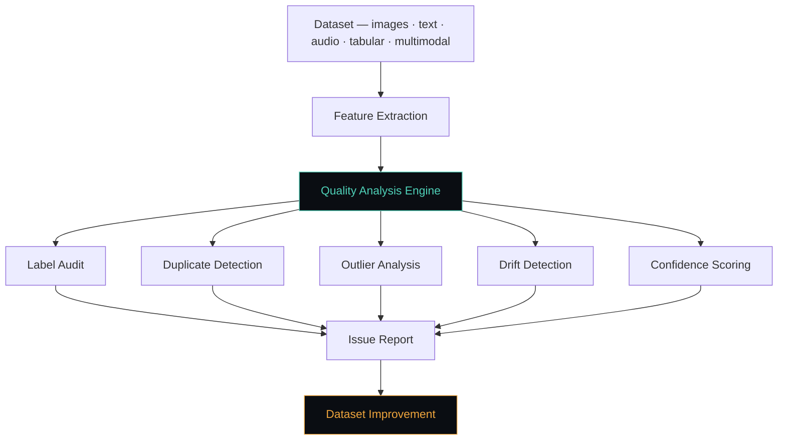

<div align="center">

# ▣ DataSentinel AI

### Your model isn't broken. Your data is.

Automated data quality intelligence for machine learning — catch label errors, duplicates, outliers, drift, and annotation conflicts before they train into your model.

[](#)
[](#license)
[](#installation)
[](#roadmap)
[](#author)

[Quick Start](#-quick-start) · [Features](#-what-it-catches) · [Architecture](#-architecture) · [Applications](#-example-applications) · [Roadmap](#-roadmap)

</div>

<br>

```diff
- Collect data → Train model → Tune → Deploy               (errors baked in)
+ Collect data → Audit dataset → Repair → Train → Deploy   (errors caught first)
```

<br>

## ◆ Why this exists

Most ML failures trace back to the dataset, not the model. DataSentinel is a data-centric
framework that inspects any dataset — image, text, audio, tabular, or multimodal — and
returns a ranked report of what's silently wrong with it.

<br>

## ▣ Quick Start

```bash
pip install datasentinel-ai
```

```python
from datasentinel import DataAudit

audit = DataAudit(dataset)
audit.find_issues(embeddings=embeddings, predictions=pred_probs)
audit.report()
```

<details>
<summary><strong>▸ Output</strong></summary>

<br>

| Metric | Result |
|---|---|
| Potential label errors | `124` |
| Duplicates detected | `37` |
| Outliers identified | `18` |
| Low-confidence samples | `92` |
| **Dataset quality score** | **`87.3 / 100`** |

</details>

<br>

## ◇ What it catches

| | Check | Description |
|---|---|---|
| 🏷️ | **Label quality** | Ranks likely mislabeled samples using model confidence + representation learning |
| 🧬 | **Duplicates** | Finds exact and semantic near-duplicates inflating your metrics |
| 📍 | **Outliers** | Flags abnormal records and distribution anomalies |
| 📉 | **Dataset drift** | Tracks divergence between training and production data over time |
| ✎ | **Annotation audit** | Measures inter-annotator agreement and labeling consistency |
| ↺ | **Active learning** | Recommends exactly which samples to review next, in priority order |

<br>

## ▣ Architecture



<br>

## ◆ Supported data & frameworks

<table>
<tr><td valign="top" width="50%">

**Data types**

| Type | Support |
|---|---|
| Images | ✅ |
| Text | ✅ |
| Audio | ✅ |
| Tabular | ✅ |
| Time series | ✅ |
| Multimodal | ✅ |

</td><td valign="top" width="50%">

**Frameworks**

- PyTorch · TensorFlow · Keras
- Scikit-Learn · XGBoost · LightGBM
- Hugging Face Transformers
- OpenAI Embeddings
- Custom models

</td></tr>
</table>

<br>

## ▣ Example Applications

<details>
<summary><strong>🖼️ Computer Vision</strong></summary>
<br>

- Catches incorrect image labels before they skew training
- Finds duplicate images across train / val / test splits
- Surfaces class imbalance hidden inside large image sets

</details>

<details>
<summary><strong>💬 Natural Language Processing</strong></summary>
<br>

- Flags annotation mistakes in labeled text corpora
- Detects intent classification inconsistencies
- Audits named entity labeling for systematic errors

</details>

<details>
<summary><strong>🛡️ Security Analytics</strong></summary>
<br>

- Validates log datasets before they train detection models
- Assesses threat intelligence feed quality at ingestion
- Audits anomaly-detection training sets for label drift

</details>

<details>
<summary><strong>🏥 Healthcare AI</strong></summary>
<br>

- Verifies medical annotations against inter-rater agreement
- Monitors dataset consistency across collection sites

</details>

<br>

## ◇ Roadmap

- [x] Label error detection
- [x] Duplicate detection
- [x] Outlier analysis
- [x] Dataset reporting
- [ ] Dataset repair suggestions
- [ ] Human-in-the-loop review
- [ ] Dataset governance dashboard
- [ ] Multi-annotator intelligence
- [ ] Enterprise monitoring

<br>

## ▣ Research foundations

`Data-Centric AI` · `Representation Learning` · `Weak Supervision` · `Active Learning` · `Outlier Detection` · `Dataset Governance` · `Trustworthy AI`

<br>

---

<div align="center">

### Author

**Yahi Abdelhak**
Cybersecurity Researcher · AI Engineer

Apache License 2.0 — see [`LICENSE`](#license)

⭐ **Star this repo** if DataSentinel AI helped clean up your dataset.

</div>
